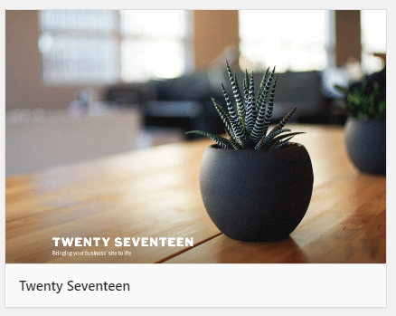
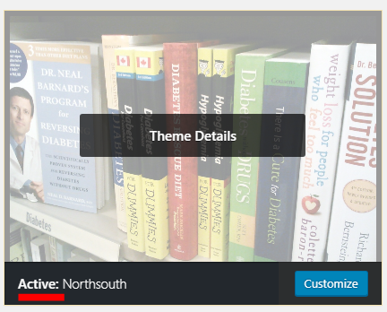
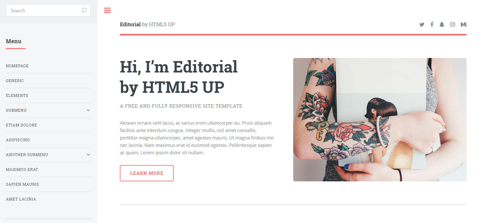
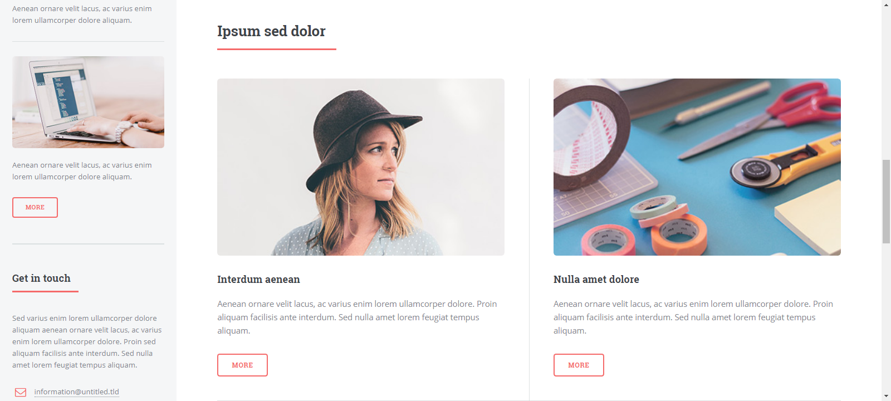
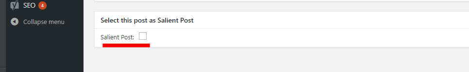
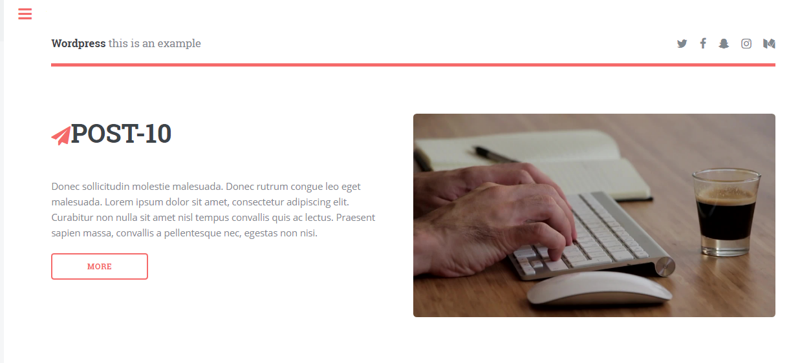
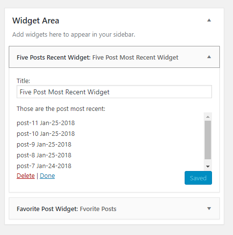
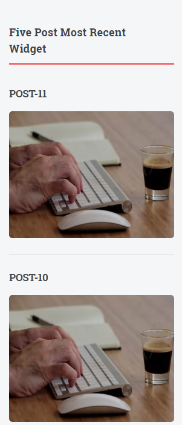

# WORDPRESS'S BLOG

## Puedes ver el blog termindao *[aquí](http://www.wordpress-cloud-example.com/)*

**Wordpress's Blog** tiene como finalidad mostrar funciones que nos ayudará a desarrollar un blog en wordpress de manera fácil y rápida,
usaremos funciones propias de wordpress para desarrollar el blog.

Para crear un blog en wordpress, empezaremos definiendo los pasos y archivos que usaremos.

1. Descargar wordpress (https://wordpress.org/).
2. Instalar wordpress en un virtual host.

Wordpress descarga una serie de archivos y carpetas, ahora sólo usaremos la carpeta wp-content y el archivo wp-config 
(aquí configuras el nombre de tu base de datos, etc; usaremos como referencia el archivo [wp-config-sample.php](wp-config-sample.php)).
Por defecto Wordpress tiene activado un tema (theme), lo desactivaremos para crear nuestro propio tema.



#### Crear un theme en wordpress:

Para crear un theme nos ubicaremos en la carpeta [wp-content/themes/](wp-content/themes/).

* Crearemos una carpeta para nuestro theme, en éste caso 'northsouth'.
* Dentro la carpeta nueva crearemos un archivo style.css, index.php, functions.php.
* Para la imagen de nuestro theme debemos añadir un archivo screenshot.jpg.

Ahora necesitamos tener una descripción de nuestro theme, para ello en el arhivo [style.css](wp-content/themes/northsouth/style.css)
añadiremos la descripción.

```php
/*
Theme Name: Northsouth
Author: Anabel Espinal
Description: Northsouth theme will help you to create your first theme easy and fast.
Version: 1.0
License: GNU General Public License v2 or later
License URI: http://www.gnu.org/licenses/gpl-2.0.html
Text Domain: northsouth
This theme, like WordPress, is licensed under the GPL.
Use it to make something cool, have fun, and share what you've learned with others.
*/
```

La descripción debe estar comentada entre '/* */'.

Ahora el el admin de nuestro sitio de wordpress debe aparecer el theme creado.



Activaremos nuestro theme.
No crearemos un template desde cero, así que usaremos uno que ya está en la web.
([https://html5up.net/editorial](https://html5up.net/editorial)).

Descargaremos el template y lo agregaremos a nuestro theme.
Nuestra estructura hasta ahora es la siguiente:

``` html
|--- wp-config-sample.php
|--- wp-content/
    |--- themes/
        |--- northsouth/
            |--- css/
            |--- fonts/
            |--- js/
            |--- index.php
            |--- functions.php
            |--- screenshot.jpg
            |--- style.css
```
Debemos dividir la página principal, así que debemos craer el archivo [footer.php](wp-content/themes/northsouth/footer.php),
 [header.php](wp-content/themes/northsouth/header.php), [sidebar.php](wp-content/themes/northsouth/sidebar.php), y el archivo 
 [index.php](wp-content/themes/northsouth/index.php) que ya lo tenemos.
 
 
 
 
 
Nuestro archivo [index.php](wp-content/themes/northsouth/index.php) estará de la siguiente manera:
 
``` php
<?php get_header(); ?>

<section id="banner">
    <?php echo do_shortcode('[salient_post]') ?>
</section>
<section>
    <?php if (have_posts()) : ?>
        <div class="posts">
            <?php while (have_posts()) : the_post(); ?>
                <article>
                    <a href="<?php echo get_permalink( get_the_ID(), false ); ?>" class="image">
                        <?php if (has_post_thumbnail()): ?>
                            <?php the_post_thumbnail('featured-post-thumb'); ?>
                        <?php endif; ?>
                    </a>
                    <h3><?php the_title(); ?></h3>
                    <p><?php the_content() ?> </p>
                </article>
            <?php endwhile; ?>
        </div>
        <div>
        <?php
        custom_pagination_northsouth()
        ?>
        </div>
    <?php endif; ?>
</section>
<?php get_footer() ?>
```

Aquí llamaremos a los otros archivos creados con las funciones:

``` php
<?php get_header(); ?>
<?php get_footer() ?>
```

Y usaremos la función have_posts() y the_post() para obtener todos los posts.

Nuestro archivo [header.php](wp-content/themes/northsouth/header.php) estará de la siguiente manera:
 
``` php
<!DOCTYPE HTML>
<html>
<head>
    <meta charset="utf-8" />
    <meta name="viewport" content="width=device-width, initial-scale=1, user-scalable=no" />
    <link rel="shortcut icon" href="<?php echo get_stylesheet_directory_uri(); ?>/favicon.ico" />
    <?php wp_head(); ?>
</head>
<body>

<!-- Wrapper -->
<div id="wrapper">

    <!-- Main -->
    <div id="main">
        <div class="inner">

            <!-- Header -->
            <header id="header">
                <span href="index.html" class="logo"><strong>Wordpress</strong> this is an example</span>
                <ul class="icons">
                    <?php if (get_theme_mod('social_network_twitter')){ ?>
                        <li>
                            <a href="<?php echo get_theme_mod('social_network_twitter', '#'); ?>" class="icon fa-twitter" id="twitter-settings">
                                <span class="label">Twitter</span>
                            </a>
                        </li>
                    <?php }
                    if (get_theme_mod('social_network_facebook')){ ?>
                        <li>
                            <a href="<?php echo get_theme_mod('social_network_facebook', '#'); ?>" class="icon fa-facebook">
                                <span class="label">Facebook</span>
                            </a>
                        </li>
                    <?php }
                    if (get_theme_mod('social_network_snp')){
                    ?>
                        <li>
                            <a href="<?php echo get_theme_mod('social_network_snp', '#'); ?>" class="icon fa-snapchat-ghost">
                                <span class="label">Snapchat</span>
                            </a>
                        </li>
                    <?php }
                    if (get_theme_mod('social_network_inst')){
                    ?>
                        <li>
                            <a href="<?php echo get_theme_mod('social_network_inst', '#'); ?>" class="icon fa-instagram">
                                <span class="label">Instagram</span>
                            </a>
                        </li>
                    <?php }
                    if (get_theme_mod('social_network_med')){
                    ?>
                        <li>
                            <a href="<?php echo get_theme_mod('social_network_med', '#'); ?>" class="icon fa-medium">
                                <span class="label">Medium</span>
                            </a>
                        </li>
                    <?php } ?>
                </ul>
            </header>
```

En nuestro archivo [footer.php](wp-content/themes/northsouth/footer.php) estará el llamado a nuestro sidebar y algunos direcciones de arhivos que usaremos, así como los archivos javascript.

``` php

</div>
</div>

<!-- Sidebar -->
<?php get_sidebar(); ?>

</div>

<?php wp_footer(); ?>

</body>
</html>
```

Y por último nuestro archivo [sidebar.php](wp-content/themes/northsouth/sidebar.php), que lo llamanos dentro del archivo
[footer.php](wp-content/themes/northsouth/footer.php)

``` php
<div id="sidebar">
    <div class="inner">

        <!-- Search -->
        <section id="search" class="alt">

            <?php get_search_form() ?>
        </section>

        <?php if (has_nav_menu('primary')) : ?>
            <nav id="menu">
                <header class="major">
                    <h2>Menu</h2>
                </header>
                <style>
                    .current-menu-item a{
                        color: #f56a6a !important;
                    }
                </style>
                <?php
                wp_nav_menu(array(
                    'menu_class' => 'nav-menu',
                    'container' => false,
                    'theme_location' => 'primary',
                ));
                ?>
            </nav><!-- .main-navigation -->
        <?php endif; ?>
        <!-- Menu -->

        <!-- SHOW WIDGETS -->
        <?php if ( is_active_sidebar( 'sidebar-1' ) ) : ?>
            <?php dynamic_sidebar( 'sidebar-1' ); ?>
        <?php endif ?>
        <!-- END -->

        <!-- Section -->
        <section>
            <header class="major">
                <h2>Get in touch</h2>
            </header>
            <p>Sed varius enim lorem ullamcorper dolore aliquam aenean ornare velit lacus, ac varius enim lorem ullamcorper dolore. Proin sed aliquam facilisis ante interdum. Sed nulla amet lorem feugiat tempus aliquam.</p>
            <ul class="contact">
                <li class="fa-envelope-o"><a href="#">information@untitled.tld</a></li>
                <li class="fa-phone">(000) 000-0000</li>
                <li class="fa-home">1234 Somewhere Road #8254<br />
                    Nashville, TN 00000-0000</li>
            </ul>
        </section>

        <!-- Footer -->
        <footer id="footer">
            <p class="copyright">&copy; Untitled. All rights reserved. Demo Images: <a href="https://unsplash.com">Unsplash</a>. Design: <a href="https://html5up.net">HTML5 UP</a>.</p>
        </footer>

    </div>
</div>
```

En nuestro archivo [index.php](wp-content/themes/northsouth/index.php) usamos las funciones get_header() y get_footer() para llamar a los archivos header and footer, pero 
dentro de esos archivos usamos:

``` php
wp_head()
wp_footer()
```

Con éstas funciones nosotros llamamos a una función de wordpress para usar las direcciones de archivos css, imágenes, javascript, etc, que usaremos.

La función con esas dirreciones de debe declarar en el archivo [functions.php](wp-content/themes/northsouth/functions.php)

La declaramos de la siguiente manera.

``` php
function northsouth_scripts()
{

    wp_enqueue_script('northsouth_html5shiv', get_template_directory_uri() . '/js/ie/html5shiv.js', array(), '1.0');
    wp_script_add_data('northsouth_html5shiv', 'conditional', 'lte IE 8');

    wp_enqueue_style('northsouth_main', get_stylesheet_directory_uri() . '/css/main.css', array(), '1.0');

    wp_enqueue_style('northsouth-ie9', get_stylesheet_directory_uri() . '/css/ie9.css', array(), '1.0');
    wp_style_add_data('northsouth-ie9', 'conditional', 'lte IE 9');

    wp_enqueue_style('northsouth-ie8', get_stylesheet_directory_uri() . '/css/ie8.css', array(), '1.0');
    wp_style_add_data('northsouth-ie8', 'conditional', 'lte IE 8');

    wp_enqueue_script('northsouth_jquery_script', get_template_directory_uri() . '/js/jquery.min.js', array(), '1.0', true);

    wp_enqueue_script('northsouth_skel_script', get_template_directory_uri() . '/js/skel.min.js', array(), '1.0', true);

    wp_enqueue_script('northsouth_main_script', get_template_directory_uri() . '/js/main.js', array('northsouth_jquery_script', 'northsouth_skel_script'), '1.0', true);

    wp_enqueue_script('northsouth_respond_script_ie8', get_template_directory() . '/js/ie/respond.min.js', array(), '1.0', true);
    wp_script_add_data('northsouth_respond_script_ie8', 'conditional', 'lte IE 8');

    wp_enqueue_script('northsouth_util_script', get_template_directory_uri() . '/js/util.js', array('northsouth_jquery_script', 'northsouth_skel_script'), '1.0', true);

}

add_action('wp_enqueue_scripts', 'northsouth_scripts');

```

Cuando llamamos a wp_head() y wp_footer() wordpress interpreta que estás llamando a la acción **wp_enqueue_scripts**
y coloca los links correctos para nuestro blog.

Así como Wordpress tienes sus propio plugins y widgets, nosotros podemos crear los nuestros.

Ahora hemos creado un plugin y un widget.

El plugin añadirá un campo checkbox en el administrador del post para que se convierta en un **Salient Post**.




Puedes ver la lógica del plugin en [Plugin Post Selected](wp-content/plugins/NSSPostSelected)

Los post que tengan marcada la opción de 'Salient Post' aparecerán en la página principal.
Ahora que tenemos nuestros post creados y marcados estarán en el banner principal:



Hacer un widget es my similar, para hacerlo crearemos nustro widget en la carpeta de nuestro theme.

Five post most recent:
[Widget Post](wp-content/themes/northsouth/Five_Posts_Recent_Widget.php)

Siguiendo la lógica de crear nuestro widget el la página de administrador nos dirigmos hacía

**appearance < widgets**



Antes debemos activar nuestros widgets en el archivo [functions.php](wp-content/themes/northsouth/functions.php).

Con nuestro widget activado en el sidebar nos mostrará los cinco posts más recientes.




Y así podemos seguir añadiendo nuevas funcionalidades a nuestro blog.
